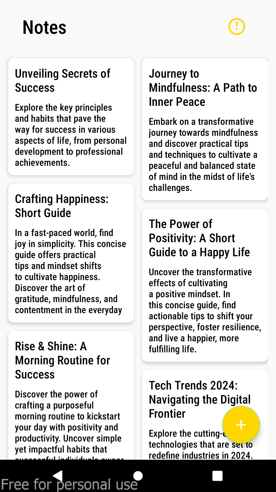

# Notes App

This Android application implements a simple notes management system using a RESTful API with CRUD operations. It follows the Model-View-ViewModel (MVVM) architectural pattern for better separation of concerns and maintainability.

## Features

- **Create**: Users can create new notes by providing a title and description.
- **Read**: Users can view a list of existing notes and view individual note details.
- **Update**: Users can edit existing notes, updating their title and description.
- **Delete**: Users can delete unwanted notes from the system.
- **Authentication**: Provides user registration and login functionalities to secure access to notes.

## Screenshots

  
  
  
  
  

## Technologies Used

- **Android Jetpack Components**: Utilizes ViewModel and LiveData for managing UI-related data in a lifecycle-aware manner.
- **Retrofit**: A type-safe HTTP client for Android used to make network requests and interact with the REST API.
- **Dagger Hilt**: Dependency injection library used for managing dependencies and improving code modularity.
- **Coroutines**: Kotlin's native asynchronous programming framework used for managing asynchronous tasks efficiently.
- **Navigation Component**: Android's navigation library used for handling navigation between different screens and fragments.
## Usage

To use the application, users need to register for an account or login if they already have one. Once logged in, they can perform CRUD operations on their notes, accessing them securely through authentication.

## Contributing

Contributions are welcome! Feel free to open issues for bugs or feature requests, and submit pull requests to contribute enhancements or fixes.

